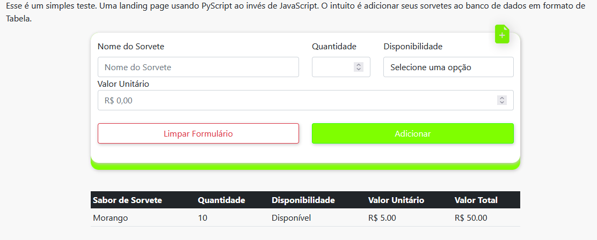

# PyScript: JavaScript Killer?

Esse repositório contém o uso exemplificado do PyScript. Se trata de uma landing page de cadastros de sorvete. Você insere o sabor, quantidade, disponibilidade e valor unitário e adiciona em sua tabela.

## Tecnologias utilizadas

As principais tecnologias utilizadas nesse projeto são listadas abaixo. É claro que pode haver tecnologias usadas que não são listadas.

>BootStrap5
>HTML5
>PyScript

